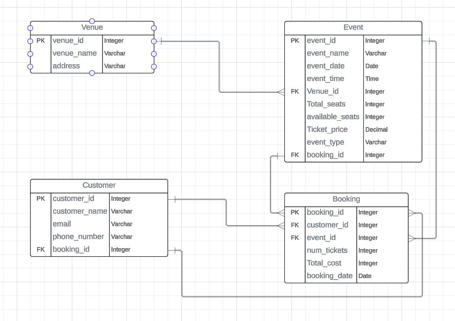

# HEXAWARE ASSIGNMENT

## Tasks 1: Database Design:

1. Create the database named "TicketBookingSystem"
```
CREATE DATABASE TicketBookingSystem;
```

2. Write SQL scripts to create the mentioned tables with appropriate data types, constraints, and
relationships.
    - Venu
    - Event
    - Customers
    - Booking

- VENU TABLE
```
CREATE TABLE Venue (
    venue_id INT PRIMARY KEY,
    venue_name VARCHAR(255) NOT NULL,
    address VARCHAR(255) NOT NULL
);
```
- EVENT TABLE
```
CREATE TABLE Event (
    event_id INT PRIMARY KEY,
    event_name VARCHAR(255) NOT NULL,
    event_date DATE NOT NULL,
    event_time TIME NOT NULL,
    venue_id INT,
    total_seats INT NOT NULL,
    available_seats INT NOT NULL,
    ticket_price DECIMAL(10, 2) NOT NULL,
    event_type VARCHAR(20) NOT NULL, -- Change data type to VARCHAR
    FOREIGN KEY (venue_id) REFERENCES Venue(venue_id)
);
```
- CUSTOMER TABLE
```
CREATE TABLE Customer (
    customer_id INT PRIMARY KEY AUTO_INCREMENT,
    customer_name VARCHAR(255) NOT NULL,
    email VARCHAR(255) NOT NULL,
    phone_number VARCHAR(20) NOT NULL
);
```
- BOOKING TABLE
```
CREATE TABLE Booking (
    booking_id INT PRIMARY KEY AUTO_INCREMENT,
    customer_id INT,
    event_id INT,
    num_tickets INT NOT NULL,
    total_cost DECIMAL(10, 2) NOT NULL,
    booking_date DATE,
    FOREIGN KEY (customer_id) REFERENCES Customer(customer_id),
    FOREIGN KEY (event_id) REFERENCES Event(event_id)
);
```
3. Create an ERD (Entity Relationship Diagram) for the database.
4. Create appropriate Primary Key and Foreign Key constraints for referential integrity.


## Tasks 2: Select, Where, Between, AND, LIKE:

1. Write a SQL query to insert at least 10 sample records into each table.

- VENUE TABLE
```
INSERT INTO Venue (venue_id,venue_name, address)
VALUES (1,'RK Beach', 'Visakhapatnam'),(2,'Tirumala', 'Tirupati'),(3,'Nagarjuna Sagar Dam', 'Nalgonda district'),(4,'Undavalli Caves', 'Guntur'),(5,'Amaravati', 'Vijayawada'),(6,'Bhavani Island', 'Vijayawada'),(7,'Kanaka Durga Temple', 'Vijayawada'),(8,'Pulicat Lake', 'Nellore'),(9,'Kolleru Lake', 'West Godavari'),(10,'Lepakshi Temple', 'Anantapur');
```
- EVENT TABLE
```
INSERT INTO Event (event_name, event_date, event_time, venue_id, total_seats, available_seats, ticket_price, event_type)
VALUES 
('Event 1', '2024-05-01', '18:00:00', 1, 100, 100, 1500.00, 'Movie'),
('Event 2', '2024-05-02', '19:00:00', 2, 150, 150, 2000.00, 'Concert'),
('Event 3', '2024-05-03', '20:00:00', 3, 200, 200, 1800.00, 'Sports'),
('Event 4', '2024-05-04', '17:00:00', 4, 120, 120, 2200.00, 'Movie'),
('Event 5', '2024-05-05', '21:00:00', 5, 180, 180, 2500.00, 'Concert'),
('Event 6', '2024-05-06', '19:30:00', 6, 90, 90, 1700.00, 'Movie'),
('Event 7', '2024-05-07', '20:30:00', 7, 160, 160, 2100.00, 'Concert'),
('Event 8', '2024-05-08', '18:30:00', 8, 130, 130, 1900.00, 'Sports'),
('Event 9', '2024-05-09', '19:00:00', 9, 110, 110, 2300.00, 'Movie'),
('Event 10', '2024-05-10', '20:00:00', 10, 140, 140, 2600.00, 'Concert');
```
- CUSTOMER TABLE
```
INSERT INTO Customer (customer_id,customer_name, email, phone_number)
VALUES 
(1,'John Doe', 'john.doe@example.com', '1234567890'),
(2,'Jane Smith', 'jane.smith@example.com', '9876543210'),
(3,'Michael Johnson', 'michael.johnson@example.com', '4567890123'),
(4,'Emily Brown', 'emily.brown@example.com', '7890123456'),
(5,'William Taylor', 'william.taylor@example.com', '2345678901'),
(6,'Olivia Wilson', 'olivia.wilson@example.com', '8901234567'),
(7,'James Anderson', 'james.anderson@example.com', '5678901234'),
(8,'Emma Martinez', 'emma.martinez@example.com', '9012345678'),
(9,'Alexander Garcia', 'alexander.garcia@example.com', '3456789012'),
(10,'Sophia Lopez', 'sophia.lopez@example.com', '6789012345');
```
- BOOKING TABLE
```
INSERT INTO Booking (booking_id, customer_id, event_id, num_tickets, total_cost, booking_date)
VALUES 
(1, 1, 1, 2, 3000.00, '2007-08-09'),
(2, 2, 2, 3, 6000.00, '2007-08-10'),
(3, 3, 3, 4, 7200.00, '2008-08-11'),
(4, 4, 4, 1, 2200.00, '2006-09-08'),
(5, 5, 5, 2, 5000.00, '2016-05-02'),
(6, 6, 6, 3, 5100.00, '2012-06-05'),
(7, 7, 7, 2, 4200.00, '2023-11-24'),
(8, 8, 8, 4, 7600.00, '2011-12-13'),
(9, 9, 9, 1, 2300.00, '2016-06-25'),
(10, 10, 10, 3, 7800.00, '2020-04-30');
```

2. Write a SQL query to list all Events
```
SELECT * FROM Event;

```
3. Write a SQL query to select events with available tickets
```
SELECT * FROM Event WHERE available_seats > 0;
```
4. Write a SQL query to select events name partial match with ‘cup’
```
SELECT * FROM Event WHERE event_name LIKE '%cup%';
```
5. Write a SQL query to select events with ticket price range is between 1000 to 2500
```
SELECT * FROM Event WHERE ticket_price BETWEEN 1000 AND 2500;
```
6. Write a SQL query to retrieve events with dates falling within a specific range
```
SELECT * FROM Event WHERE event_date BETWEEN '2024-05-01' AND '2024-05-05';
```
7. Write a SQL query to retrieve events with available tickets that also have "Concert" in their
name
```
SELECT * FROM Event WHERE available_tickets > 0 AND event_type='concert';
```
8. Write a SQL query to retrieve users in batches of 5, starting from the 6th user
```
SELECT * FROM Customer ORDER BY customer_name OFFSET 5 ROWS FETCH NEXT 5 ROWS ONLY;
```
9. Write a SQL query to retrieve bookings details contains booked no of ticket more than 2.
```
SELECT * FROM Booking WHERE num_tickets > 4;
```
10. Write a SQL query to retrieve customer information whose phone number end with ‘000’
```
SELECT * FROM Customer WHERE phone_number LIKE '%000';
```
11. Write a SQL query to retrieve the events in order whose seat capacity more than 15000.
```
SELECT * FROM Event WHERE available_seats > 15000 ORDER BY event_date;
```
12. Write a SQL query to select events name not start with ‘x’, ‘y’, ‘z’
```
SELECT * FROM Event WHERE event_name NOT LIKE 'x%' AND event_name NOT LIKE 'y%' AND event_name NOT LIKE 'z%';
```

## Tasks 3: Aggregate functions, Having, Order By, GroupBy and Joins:

1. Write a SQL query to List Events and Their Average Ticket Prices
```
SELECT event_name, AVG(ticket_price) AS avg_price
FROM Event
GROUP BY event_name;
```
2. Write a SQL query to Calculate the Total Revenue Generated by Events.
```
SELECT SUM(total_cost) AS total_revenue
FROM Booking;
```
3. Write a SQL query to find the event with the highest ticket sales.
```
select * from event where event_id=(select event_id from booking order by num_tickets desc OFFSET 0 ROWS FETCH NEXT 1 ROWS ONLY);
```
4. Write a SQL query to Calculate the Total Number of Tickets Sold for Each Event.
```
SELECT event_id,SUM(num_tickets) 
FROM Booking
GROUP BY event_id;
```
5. Write a SQL query to Find Events with No Ticket Sales.
```
SELECT *
FROM Event
WHERE event_id NOT IN (
    SELECT DISTINCT event_id
    FROM Booking
);
```
6. Write a SQL query to Find the User Who Has Booked the Most Tickets.
```
select * from customer where customer_id=(select customer_id from booking order by num_tickets desc OFFSET 0 ROWS FETCH NEXT 1 ROWS ONLY);
```
7. Write a SQL query to List Events and the total number of tickets sold for each month.
```
SELECT MONTH(event_date) AS month, COUNT(booking_id) AS total_tickets_sold
FROM Booking
JOIN Event ON Booking.event_id = Event.event_id
GROUP BY MONTH(event_date);
```
8. Write a SQL query to calculate the average Ticket Price for Events in Each Venue.
```
SELECT v.venue_id, v.venue_name, AVG(e.ticket_price) AS avg_ticket_price
FROM Venue v
JOIN Event e ON v.venue_id = e.venue_id
GROUP BY v.venue_id, v.venue_name;
```
9. Write a SQL query to calculate the total Number of Tickets Sold for Each Event Type.
```
SELECT event_type, SUM(num_tickets) AS total_tickets_sold
FROM Booking
JOIN Event ON Booking.event_id = Event.event_id
GROUP BY event_type;
```
10. Write a SQL query to calculate the total Revenue Generated by Events in Each Year.
```
SELECT YEAR(event_date) AS year, SUM(total_cost) AS total_revenue
FROM Booking
JOIN Event ON Booking.event_id = Event.event_id
GROUP BY YEAR(event_date);
```
11. Write a SQL query to list users who have booked tickets for multiple events.
```
SELECT booking.customer_id,COUNT(DISTINCT event_id) AS total_events_booked
FROM Booking
JOIN Customer ON Booking.customer_id = Customer.customer_id
GROUP BY booking.customer_id
HAVING COUNT(DISTINCT event_id) > 1;
```
12. Write a SQL query to calculate the Total Revenue Generated by Events for Each User.
```
SELECT booking.customer_id, customer_name, SUM(total_cost) AS total_revenue
FROM Booking
JOIN Customer ON Booking.customer_id = Customer.customer_id
GROUP BY booking.customer_id, customer_name;
```
13. Write a SQL query to calculate the Average Ticket Price for Events in Each Category and Venue.
```
SELECT v.venue_id, v.venue_name, e.event_type, AVG(e.ticket_price) AS avg_ticket_price
FROM Venue v
JOIN Event e ON v.venue_id = e.venue_id
GROUP BY v.venue_id, v.venue_name, e.event_type;
```
14. Write a SQL query to list Users and the Total Number of Tickets They've Purchased in the Last 30
Days.
```

```
## Tasks 4: Subquery and its types
1. Calculate the Average Ticket Price for Events in Each Venue Using a Subquery.
```
SELECT v.venue_id, v.venue_name,
       (SELECT AVG(ticket_price) FROM Event WHERE venue_id = v.venue_id) AS avg_ticket_price
FROM Venue v;
```
2. Find Events with More Than 50% of Tickets Sold using subquery.
```
SELECT event_id, event_name
FROM Event
WHERE (SELECT SUM(num_tickets) FROM Booking WHERE Booking.event_id = Event.event_id) > (0.5 * total_seats);
```
3. Calculate the Total Number of Tickets Sold for Each Event.
```
SELECT event_id, event_name,
       (SELECT SUM(num_tickets) FROM Booking WHERE Booking.event_id = Event.event_id) AS total_tickets_sold
FROM Event;
```
4. Find Users Who Have Not Booked Any Tickets Using a NOT EXISTS Subquery.
```
SELECT customer_id, customer_name
FROM Customer c
WHERE NOT EXISTS (SELECT 1 FROM Booking WHERE customer_id = c.customer_id);
```
5. List Events with No Ticket Sales Using a NOT IN Subquery.
```
SELECT event_id, event_name
FROM Event
WHERE event_id NOT IN (SELECT DISTINCT event_id FROM Booking);
```
6. Calculate the Total Number of Tickets Sold for Each Event Type Using a Subquery in the FROM
Clause.
```

```
7. Find Events with Ticket Prices Higher Than the Average Ticket Price Using a Subquery in the
WHERE Clause.
```
SELECT event_id, event_name, ticket_price
FROM Event
WHERE ticket_price > (SELECT AVG(ticket_price) FROM Event);
```
8. Calculate the Total Revenue Generated by Events for Each User Using a Correlated Subquery.
```
SELECT c.customer_id, c.customer_name,
       (SELECT SUM(total_cost) FROM Booking WHERE Booking.customer_id = c.customer_id) AS total_revenue
FROM Customer c;
```
9. List Users Who Have Booked Tickets for Events in a Given Venue Using a Subquery in the WHERE
Clause.
```
SELECT customer_id, customer_name
FROM Customer
WHERE customer_id IN (SELECT DISTINCT customer_id FROM Booking WHERE event_id IN (SELECT event_id FROM Event WHERE venue_id = 'YourVenueID'));
```
10. Calculate the Total Number of Tickets Sold for Each Event Category Using a Subquery with
GROUP BY.
```

```
11. Find Users Who Have Booked Tickets for Events in each Month Using a Subquery with
DATE_FORMAT.
```
SELECT customer_id, customer_name, MONTH(booking_date) AS booking_month
FROM Booking
JOIN Customer ON Booking.customer_id = Customer.customer_id
GROUP BY customer_id, customer_name, MONTH(booking_date);
```
12. Calculate the Average Ticket Price for Events in Each Venue Using a Subquery
```
SELECT v.venue_id, v.venue_name,
       (SELECT AVG(ticket_price) FROM Event WHERE venue_id = v.venue_id) AS avg_ticket_price
FROM Venue v;
```
